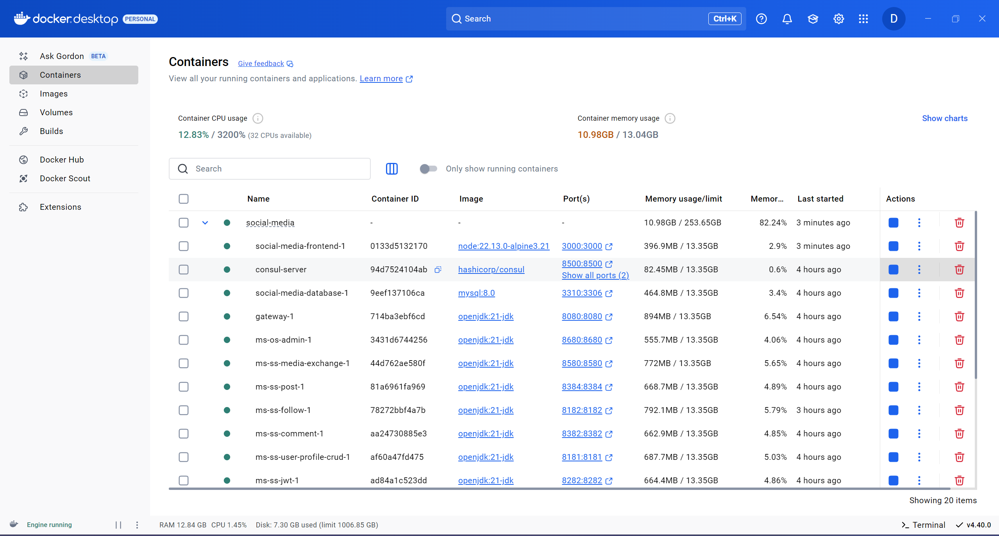
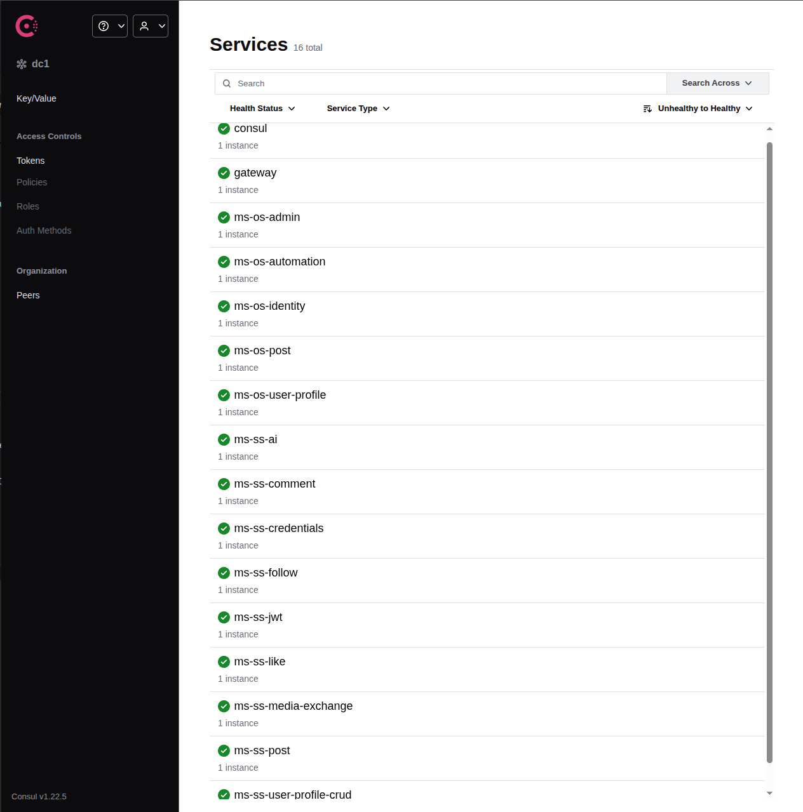
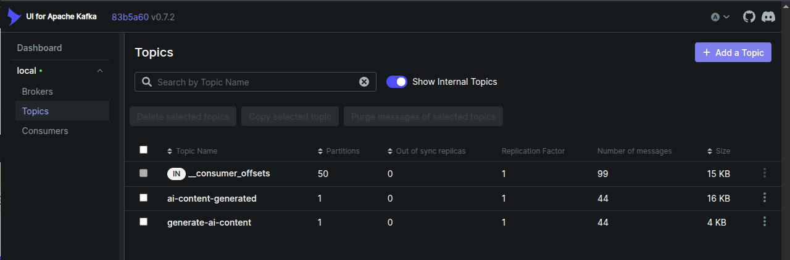
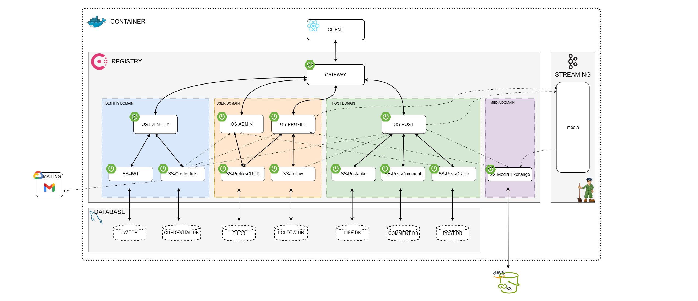

# Social Media Project
Social Media Project is a Twitter-like application designed to showcase the Microservice Architecture Pattern. It leverages technologies such as Spring Boot, Spring Cloud, Kafka, Consul, MySQL, React, and AWS S3.

The entire project is fully dockerized for seamless deployment. While image storage is integrated with AWS S3, the application can still run without it.

# Content
- [How to Run](#how-to-run)
- [Project Structure](#project-structure)
- - [Container](#container)
- - [Client](#client)
- - [Registry](#registry)
- - [Gateway](#gateway)
- - [Domains](#domains)
- - [Streaming](#streaming)
- - [Database](#database)
- - [Object Storage](#object-storage)
- - [Mailing](#mailing)

# How to Run
Clone this root repository and it's submodules by running: 

```
git clone --recurse-submodules https://github.com/desmondsyu/social-media.git
```

In the root repo (social-media), create a .env and add the following: 

```env
MYSQL_DATABASE=[your_database_name] 
MYSQL_ROOT_PASSWORD=[your_password] 
JWT_KEY=[generated_key(512)]
FRONT_END_URL=[front_end_url(http://localhost:3000)]
SMTP_USERNAME=[google_account]
SMTP_PASSWORD=[google_app_password]
AWS_REGION=[aws_region(ca-central-1)]
AWS_ACCESS_KEY_ID=[access_key]
AWS_SECRET_ACCESS_KEY=[secret_key]
AWS_S3_BUCKET_NAME=[S3_bucket_name]
```

For more information of SMTP credentials, visit https://support.google.com/accounts/answer/185833

In the root directory, deploy the whole project in Docker by running
```bash
docker compose up -d
```

To remove all container including volumes, run
```bash
docker compose dowm -v
```
There should be 19 containers running including
- 1 Database
- 1 Front End
- 1 Zookeeper
- 1 Kafka
- 1 Kafka UI
- 1 Consul
- 1 Gateway
- 4 Orchestrations
- 8 Choreography



In the Consul UI, should be 14 services running


One consumer and one topic in Kafka UI


# Project Structure


## Container

## Client

## Registry

## Gateway

## Domains

## Streaming

## Database

## Object Storage

## Mailing


# Contributors
| Name | N_ID |
| ----------- | ----------- |
| Marina Carvalho | N01606437 |
| Vitaly Sukhinin | N01605938 |
| Kexin Zhu | N01621302 |
| Samruddhi Chavan | N01604191 |
| Sruthi Pandiath | N01618202 |
