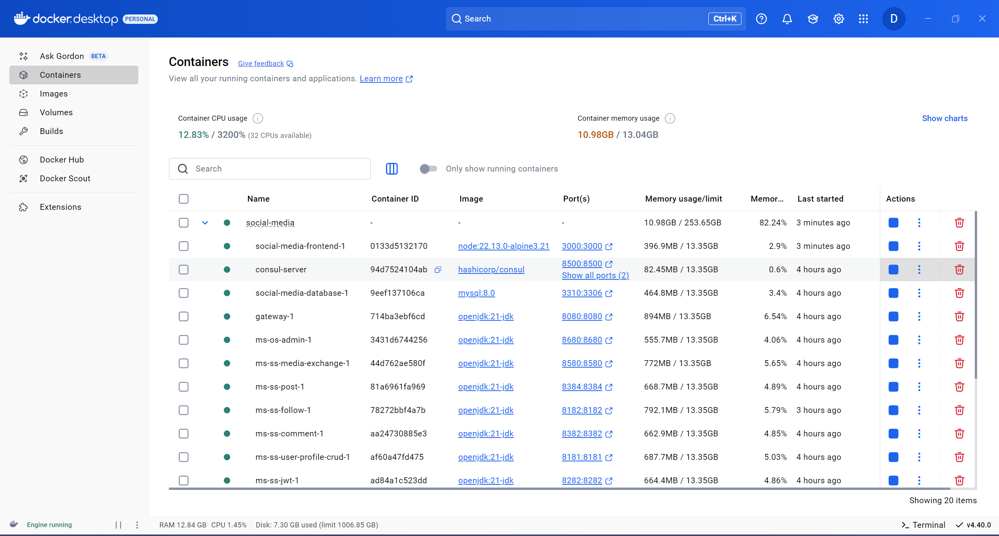
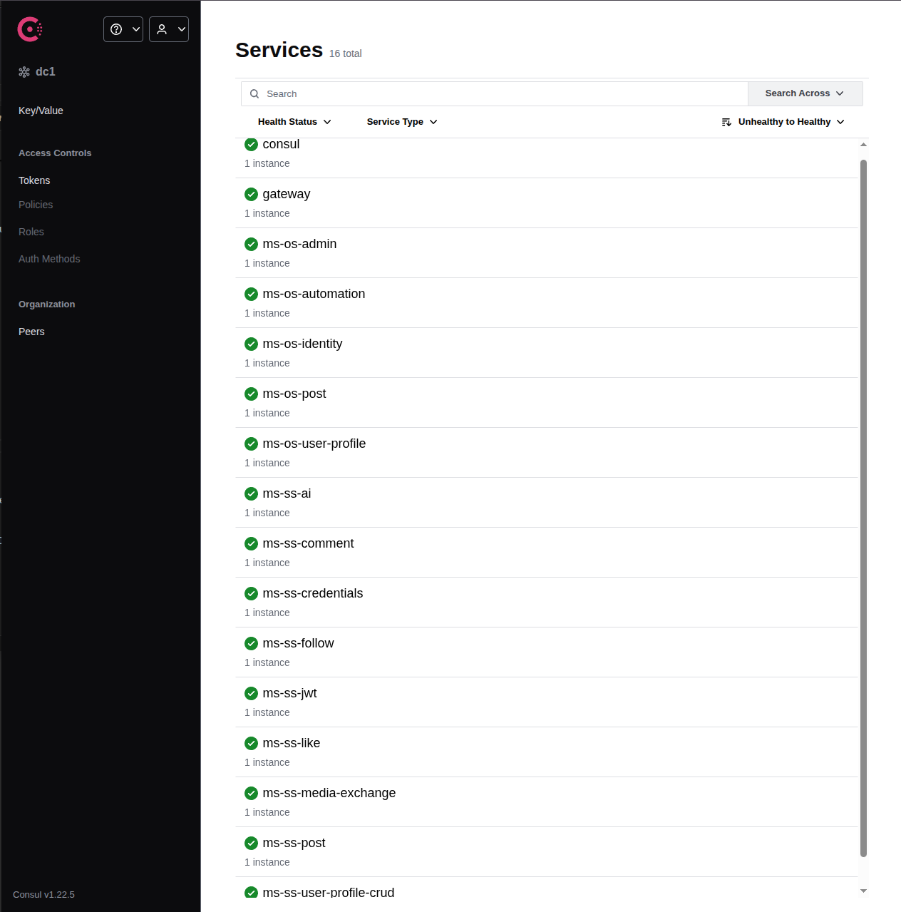
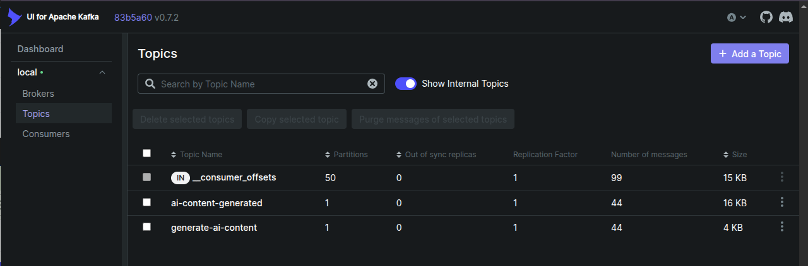
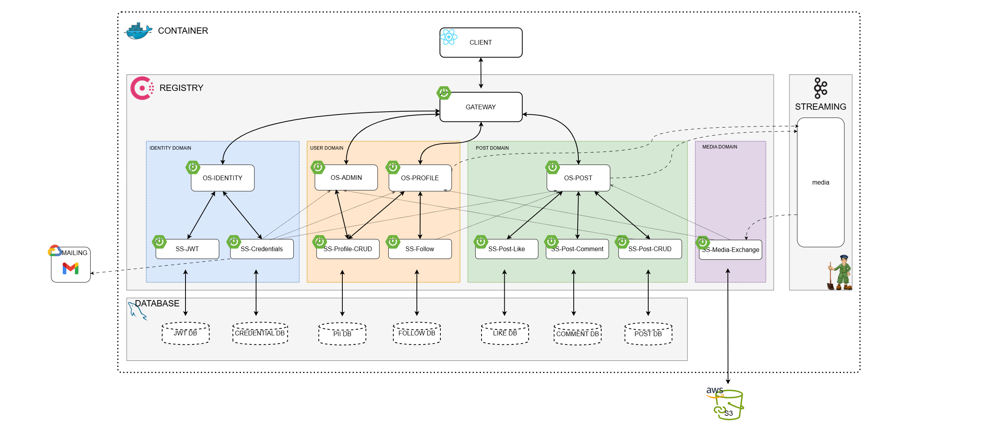

# Social Media Project

Social Media Project is a Twitter-like application designed to showcase the Microservice Architecture Pattern. It
leverages technologies such as Spring Boot, Spring Cloud, Kafka, Consul, MySQL, React, Ollama, Redis and AWS S3.

The entire project is fully dockerized for seamless deployment.

## 🚀 Live Demo

Try the running application:

**🔗 https://sm.vitalysukhinin.com**

# Content

- [How to Run](#how-to-run)
- [Project Structure](#project-structure)
    - [Container](#container)
    - [Client](#client)
    - [Registry](#registry)
    - [Gateway](#gateway)
    - [Domains](#domains)
    - [Streaming](#streaming)
    - [Database](#database)
    - [Object Storage](#object-storage)
    - [Mailing](#mailing)
    - [AI Integration](#ai-integration)
- [Contributors](#contributors)

# How to Run

Clone this root repository:

```
git clone --recurse-submodules https://github.com/kryptt0n/social-media.git
```

In the root (/social-media), create a .env and add the following:

```env
MYSQL_DATABASE=[your_database_name] 
MYSQL_ROOT_PASSWORD=[your_password] 

JWT_KEY=[generated_key(512)]

FRONT_END_URL=[front_end_url(http://localhost:3000)]

SMTP_USERNAME=[google_account]
SMTP_PASSWORD=[google_app_password]

S3_REGION=[aws_region(ca-central-1)]
S3_ACCESS_KEY_ID=[s3_access_key]
S3_SECRET_ACCESS_KEY=[s3_secret_key]
S3_BUCKET_NAME=[s3_bucket_name(social-network)]
S3_INTERNAL_ENDPOINT=[internal_s3_endpoint(http://minio:9000)]
S3_PUBLIC_ENDPOINT=[public_s3_endpoint(http://localhost:9000)]
S3_ROOT_USERNAME=[minio_root_username]
S3_ROOT_PASSWORD=[minio_root_password]

AI_MODEL=[ai_model_name]
AI_URL=[ai_service_url]

OAUTH_DOMAIN=[oauth_provider_domain(e.g. auth0_domain)]
OAUTH_CLIENT_ID=[oauth_client_id]
OAUTH_CLIENT_SECRET=[oauth_client_secret]
OAUTH_REDIRECT=[oauth_callback_url]
OAUTH_MAIN_URL=[frontend_main_url]
OAUTH_USERNAME_URL=[frontend_username_setup_url]

REDIS_PASSWORD=[redis_password]
REDIS_HOST=[redis_host]
REDIS_PORT=[redis_port]
```

For more information of SMTP credentials, visit https://support.google.com/accounts/answer/185833

In the root directory, deploy the whole project in Docker by running

```bash
docker compose up -d
```

To remove all container including volumes, run

```bash
docker compose down -v
```

There should be 23 containers running including

- 3 Databases
- 1 Front End
- 1 Kafka
- 1 Kafka UI
- 1 Consul
- 1 Gateway
- 5 Orchestrations
- 9 Choreography
- 1 Ollama



In the Consul UI, should be 16 services running


One consumer and twp topics in Kafka UI


# Project Structure



## Container

This directory contains the compose.yaml file and other container-related
configurations that orchestrate the deployment of all microservices, databases,
and supporting tools (like Kafka, Consul, etc.). It ensures seamless startup and
teardown of the entire microservice ecosystem using Docker.

In the yaml it defines volume and working dir for each container.
This could build the container without dockerfile.

## Client

The front-end application built with React. It communicates with the backend via
the API Gateway and provides an interactive UI for users to register, log in, create
posts, follow/unfollow users, like, comment, and manage their profiles. This component
is also responsible for consuming content and rendering media from AWS S3.

## Registry

The Service Registry built using HashiCorp Consul via Spring Cloud Consul.
It enables service discovery by allowing all microservices to dynamically
register themselves and query the location of other services. This decouples
service communication and ensures fault-tolerant, scalable routing in a dynamic
microservices' environment.

## Gateway

A Spring Cloud Gateway service that acts as a unified entry point for all client
requests. It routes traffic to the appropriate backend services based on the URL
path. It also handles cross-cutting concerns like authentication, logging, and
CORS configuration.

## Domains

This directory contains the core business services, each built as an independent Spring Boot microservice following the
Domain-Driven Design principle. Examples include services like:

User Service – Manages user registration, login, and profiles.

Post Service – Handles creation and retrieval of user posts.

Follow Service – Manages follow/unfollow logic and social connections.

Comment Service – Manages comments and interactions.

Each domain is responsible for its own data and logic, promoting loose coupling and high cohesion.

## Streaming

This module handles asynchronous messaging using Apache Kafka.
Kafka enables event-driven communication between microservices, supporting both
orchestration and choreography patterns. Services can publish and subscribe to
image creations, enabling
loose coupling and real-time updates.

This setup supports scalable and resilient event-driven architecture within the system.

## Database

Contains initialization scripts, SQL schemas, and Docker setup for the MySQL
database. Each microservice may have its own schema (following the Database-per-Service
pattern), ensuring autonomy and encapsulation of data. All schemas are in one single database instance.

Identity Orchestration microservice has it's own cache implemented by Redis to ensure fast access 
to demanding resources.

## Object Storage

Manages the integration with AWS S3 for storing and retrieving user-uploaded images or files.
It includes service-level logic for upload handling, access permissions,
and S3 bucket management.

## Mailing

Handles the email notification system using SMTP. It's responsible for  
password resets, and other notification emails. It’s configured to work with Gmail SMTP
and uses secure application credentials.

## AI Integration

Provides AI-powered content generation for automated users on the platform.  
The service integrates with **Ollama** to run local large language models that generate posts dynamically for AI-driven accounts. These AI users simulate realistic activity within the social network by periodically creating posts based on prompts or predefined behaviors. Running the models through Ollama allows the system to keep inference **local, efficient, and fully controllable**, without relying on external AI APIs.


# Contributors

| Role        | Name             |
|-------------|------------------|
| Team Leader | Vitaly Sukhinin  |
| Member      | Marina Carvalho  |
| Member      | Desmond Zhu      |
| Member      | Samruddhi Chavan |
| Member      | Sruthi Pandiath  |
